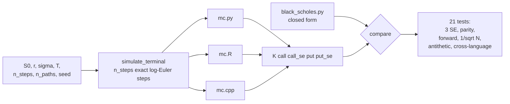

# monte-carlo-options-multilang

[](https://github.com/vincal848/monte-carlo-options-multilang/actions/workflows/tests.yml)

This project came out of an exercise in writing the same Monte Carlo simulation
three times, once each in R, C++ and Python, to compare how the languages felt to
work in. The three scripts simulated stock price paths under geometric Brownian
motion and two of them priced a European call off the simulated paths.

I have since rebuilt it. **The original pricing was not risk-neutral: it simulated
paths under the real-world drift mu = 0.05 but discounted the payoff at the
risk-free rate r = 0.03, which overprices every call by 12-15% and is not close to
a statistical fluke -- the error is 55-62 standard errors from Black-Scholes.** The
three scripts also priced different things from each other (different strikes, and
the Python version did not price at all), so "three languages, same model" was not
true even before the drift bug. All three now simulate the same risk-neutral model,
price the same strikes, and are checked against the closed-form price and against
each other.


*200,000 simulated terminal prices land on the lognormal density GBM implies --
this is a check on the simulator, independent of whether the pricing is
risk-neutral.*

## At a glance

| | |
|---|---|
| **Methods** | Risk-neutral GBM, exact log-Euler steps; closed-form Black-Scholes as the reference; antithetic variates as an option |
| **Inputs** | S0, r, sigma, T, step count, path count, a list of strikes, a seed |
| **Outputs** | Call and put price with standard error, per strike, in R, C++ and Python |
| **Validation** | 21 tests: MC vs Black-Scholes within 3 SE, pathwise put-call parity, E[S_T] at the risk-neutral forward, SE ~ 1/sqrt(N), antithetic variance reduction, seed reproducibility, invalid inputs, cross-language agreement |
| **Headline result** | The original's drift/discounting mismatch overprices the K=105 call by 14.7% (8.18 vs 7.13, a gap of 1.05), 55 standard errors away |
| **Stack** | Python (NumPy), R, C++17 -- standard library only in C++ |

## Results

Every number below is from `python run.py compare --n-paths 200000`, which runs
the Python implementation directly and shells out to `mc.R` (Rscript) and `mc.cpp`
(compiled with `g++ -O2 -std=c++17`) with identical parameters. C++ is verified in
CI (see `.github/workflows/tests.yml`); this machine has no local `g++`, so the
run below has no C++ row -- CI's `cross-language` job runs the same comparison with
all three.

S0=100, r=0.03, sigma=0.2, T=1, 252 steps, 200,000 paths, seed 123:

| K | method | call | call SE | \|err\|/SE | put | put SE | \|err\|/SE |
|---|---|---|---|---|---|---|---|
| 95 | python | 12.209440 | 0.034941 | 0.85 | 4.353870 | 0.016999 | 1.07 |
| 95 | R | 12.201559 | 0.034942 | 0.63 | 4.350980 | 0.016966 | 1.22 |
| 95 | black-scholes | 12.179702 | - | - | 4.372028 | - | - |
| 100 | python | 9.437013 | 0.031587 | 0.75 | 6.433670 | 0.020893 | 1.16 |
| 100 | R | 9.430979 | 0.031587 | 0.56 | 6.432628 | 0.020862 | 1.21 |
| 100 | black-scholes | 9.413403 | - | - | 6.457957 | - | - |
| 105 | python | 7.146039 | 0.028058 | 0.64 | 8.994924 | 0.024726 | 1.21 |
| 105 | R | 7.143753 | 0.028056 | 0.56 | 8.997629 | 0.024694 | 1.21 |
| 105 | black-scholes | 7.128065 | - | - | 9.024846 | - | - |

Every row is within 1.3 standard errors of Black-Scholes -- what a correctly
risk-neutral simulation should look like, and the opposite of the 55-62 SE gap the
drift bug produced (next section).

Antithetic variates, same seed, K=100, 10,000 paths: plain SE 0.1404, antithetic
SE 0.1047, a 1.34x reduction in SE (1.8x in variance). Smaller than the 2x a
perfectly linear payoff would give, because `max(S_T - K, 0)` is convex and
antithetic pairing only cancels the linear part of the path-to-payoff map.


*Standard error of the K=100 call against path count, log-log. It tracks
1/sqrt(N), which is the only convergence rate Monte Carlo has -- more steps would
not help, since the log-Euler step is already exact for constant-coefficient GBM.*

## How it works



Each language simulates `n_steps` log-Euler steps of
`S_{t+dt} = S_t * exp((r - sigma^2/2) dt + sigma sqrt(dt) Z)` under the risk-neutral
rate `r`, not a real-world drift. For constant `r` and `sigma` this step is exact
for GBM (there is no discretization error to reduce by adding steps), so the only
error that remains is Monte Carlo sampling error, which falls as `1/sqrt(n_paths)`.
Every strike in a run reuses the same simulated terminal prices, so put-call parity
holds exactly path by path rather than as two estimates that happen to agree.

## Decisions

- **Reuse one simulated sample across every strike in a table**, rather than
  resimulating per strike. This is what makes put-call parity an exact identity on
  the Monte Carlo output (`call - put == discount * (mean(S_T) - K)` to floating
  point, not to 3 SE) and is also just less work.
- **Antithetic variates computed as paired averages, not as more raw paths.** The
  standard error of antithetic sampling has to be computed from the `n_paths/2`
  pair averages `(payoff(Z) + payoff(-Z))/2`, not from the `n_paths` raw payoffs
  treated as independent -- the whole point of antithetic pairing is that the two
  halves of a pair are negatively correlated, and averaging raw payoffs would
  overstate the effective sample size and understate the standard error.
- **A fixed, parseable table format (`K call call_se put put_se`) shared by all
  three languages**, rather than three different printouts, so `run.py compare`
  reads R's and C++'s stdout the same way it builds its own table. This is also
  why the format doesn't try to be pretty.
- **No `#include <algorithm>` left to chance.** It's an easy one-line fix, but it
  is listed as a defect on its own because it is a specific, checkable instance of
  the standard-library-only constraint `mc.cpp` is held to.
- **`black_scholes.py` uses `math.erf` instead of `scipy.stats.norm`.** One
  function, standard library only, so importing it for tests or for `run.py
  compare` does not pull in scipy.
- **Full path arrays only for plotting, not for every path in a pricing run.**
  `simulate_terminal` returns only the terminal prices needed for pricing;
  `simulate_paths`, used only by `plots.paths_fan`, returns the full step-by-step
  array and is called with a small path count.

## Quick start

```bash
pip install -r requirements.txt
```

```bash
python run.py price --strikes 95,100,105 --n-paths 200000
python run.py compare --n-paths 200000
python plots.py          # regenerates docs/img/*.png
```

```bash
Rscript mc.R --s0 100 --r 0.03 --sigma 0.2 --T 1 --n-steps 252 --n-paths 10000 --strikes 95,100,105 --seed 123
g++ -O2 -std=c++17 -o mc mc.cpp && ./mc --s0 100 --r 0.03 --sigma 0.2 --T 1 --n-steps 252 --n-paths 10000 --strikes 95,100,105 --seed 123
```

```bash
pytest tests -q    # 21 tests; set RSCRIPT to Rscript's path if it is not on PATH
```

## Repository guide

| Path | Contents |
|---|---|
| `mc.py` | Simulation, pricing, standard error (pure computation, no I/O) |
| `black_scholes.py` | Closed-form price, the reference all three languages are checked against |
| `mc.R` | R port: identical model, identical table format |
| `mc.cpp` | C++ port: identical model, identical table format, standard library only |
| `run.py` | `price` (Python only), `compare` (all three languages vs Black-Scholes), and the shared table format: print, parse, JSON |
| `plots.py` | `docs/img` figures: path fan, terminal histogram, SE convergence |
| `tests/` | 21 tests, including cross-language checks that skip a missing toolchain locally but fail when `CI` is set |
| `docs/img/` | Generated figures |
| `legacy/` | The three original scripts, annotated with their defects. Not imported; known broken |

## Future interests

- **Greeks from pathwise or likelihood-ratio estimators**, to put Monte Carlo
  sensitivities next to the closed-form ones the way `options_pricing` compares
  binomial and finite-difference Greeks to Black-Scholes.
- **Variance reduction beyond antithetic**: control variates using the
  Black-Scholes price of a related option, or quasi-random (Sobol) sequences in
  place of `std::mt19937` / NumPy's PCG64.
- **American and path-dependent payoffs**, where Monte Carlo's advantage over a
  lattice shows up (Longstaff-Schwartz for American exercise, barrier and Asian
  payoffs that use the full path rather than just `S_T`).
- **A fourth language purely to test the table format's portability** -- the
  `K call call_se put put_se` convention was designed to be trivial to reproduce.

## Notes

- `n_steps=252` and exact log-Euler steps means this is already the GBM-exact
  terminal distribution; more steps would not change the result, only more paths
  would. The step count is kept configurable and simulated in full (not collapsed
  to one draw) because the original bug was specifically about step count
  disagreeing with the discounting horizon, and collapsing the simulation would
  make that class of bug impossible to reintroduce by construction rather than
  catch by testing.
- Antithetic variance reduction is modest here (1.34x in SE) because the call and
  put payoffs are convex, not linear, in the simulated path -- antithetic pairing
  only cancels the linear component of the mapping from `Z` to payoff.
  Variance-reduction numbers are at `n_paths=10000`, S0=100, K=100 and will vary
  with moneyness.
- Local R is at `"/c/Program Files/R/R-4.5.2/bin/Rscript.exe"`, not on PATH; tests
  and `run.py` honor an `RSCRIPT` environment variable if set, then that path,
  then `Rscript` on PATH. There is no local C++ compiler on this machine, so
  `mc.cpp` is verified by CI's `cross-language` job rather than locally -- it was
  written carefully but has not been run here.
- Timings are not reported; this is single-threaded Monte Carlo and the dominant
  cost is `n_steps * n_paths` normal draws, which is the same asymptotic cost in
  all three languages.
